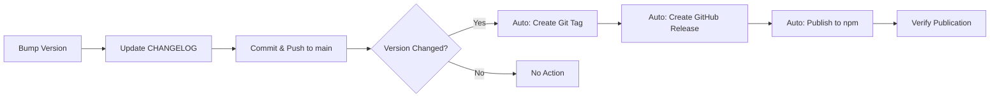

# MeMesh Release Process

This document describes the complete release process for MeMesh, including versioning, changelog maintenance, and automated publishing.

## Overview

MeMesh uses **fully automated release and publishing** triggered by version changes. When `package.json` version is updated and pushed to main, GitHub Actions automatically:

1. Detects the version change
2. Creates a git tag
3. Creates a GitHub Release with changelog
4. Publishes to npm

This automation prevents version/tag discrepancies and ensures every version bump gets a proper release.

## Release Workflow



## Step-by-Step Guide

### 1. Prepare Release

#### Check Current State

```bash
# Ensure working directory is clean
git status

# Pull latest changes
git pull origin main

# Check current version
npm version
```

#### Run Full Test Suite

```bash
# Build
npm run build

# Run all tests
npm test

# Run installation tests
npm run test:install

# Type check
npm run typecheck

# Linting
npm run lint
```

All tests must pass before proceeding.

### 2. Version Bump

Choose the appropriate version bump:

- **Patch** (X.Y.Z → X.Y.Z+1): Bug fixes, minor improvements
- **Minor** (X.Y.Z → X.Y+1.0): New features, backward compatible
- **Major** (X.Y.Z → X+1.0.0): Breaking changes

```bash
# Patch release (most common)
npm version patch --no-git-tag-version

# Minor release
npm version minor --no-git-tag-version

# Major release
npm version major --no-git-tag-version
```

**Note**: We use `--no-git-tag-version` because GitHub Release creates the tag.

### 3. Update CHANGELOG.md

Add a new entry following [Keep a Changelog](https://keepachangelog.com/) format:

```markdown
## [X.Y.Z] - YYYY-MM-DD

### Added
- New features

### Changed
- Changes in existing functionality

### Deprecated
- Soon-to-be removed features

### Removed
- Removed features

### Fixed
- Bug fixes

### Security
- Security fixes
```

**Example**:
```markdown
## [2.6.6] - 2026-02-03

### Fixed
- GitHub Actions npm publish workflow - replaced invalid GitHub API method with logging
- Fixed workflow comment step that was causing publish failures
```

### 4. Commit Changes

```bash
git add package.json CHANGELOG.md
git commit -m "chore(release): bump version to X.Y.Z

- Brief description of changes
- Reference to issues/PRs if applicable

Co-Authored-By: Claude Sonnet 4.5 <noreply@anthropic.com>"
```

### 5. Push to Main

```bash
git push origin main
```

**✨ That's it!** The automated workflow will now:
1. Detect the version change in `package.json`
2. Extract changelog for the new version
3. Create a git tag `vX.Y.Z`
4. Create a GitHub Release with changelog
5. Trigger npm publishing workflow

You can monitor the progress in GitHub Actions.

### 6. Monitor Automated Release Creation

#### Using GitHub CLI

```bash
# Watch the auto-release workflow
gh run watch --repo PCIRCLE-AI/claude-code-buddy

# Or list recent runs
gh run list --workflow=auto-release.yml --limit 3
```

#### Using GitHub Web Interface

1. Go to https://github.com/PCIRCLE-AI/claude-code-buddy/actions
2. Check the "Auto Release" workflow
3. Verify tag creation and release creation steps succeed
4. Then check "Publish to npm" workflow

### 7. Automated Release and Publishing

The automation happens in two stages:

#### Stage 1: Auto Release (.github/workflows/auto-release.yml)

Triggered when `package.json` is pushed to main:

1. **Check Version Change**
   - Compares current vs. previous package.json version
   - Skips if version unchanged

2. **Create Release** (if version changed):
   ```yaml
   ✓ Extract changelog for version
   ✓ Create annotated git tag
   ✓ Push tag to GitHub
   ✓ Create GitHub Release with changelog
   ```

3. **Expected Duration**: ~1-2 minutes

#### Stage 2: NPM Publishing (.github/workflows/publish-npm.yml)

Triggered when GitHub Release is published:

1. **Build and Test**:
   ```yaml
   ✓ Checkout code
   ✓ Setup Node.js 20
   ✓ Install dependencies (npm ci)
   ✓ Build project (npm run build)
   ✓ Run tests (npm test)
   ✓ Run installation tests
   ✓ Verify package contents
   ✓ Publish to npm (with provenance)
   ✓ Log success
   ```

2. **Expected Duration**: ~2-3 minutes

**Total Time**: ~3-5 minutes from push to npm publication

### 8. Monitor Workflows

#### Using GitHub CLI

```bash
# Watch auto-release workflow
gh run watch --workflow=auto-release.yml

# Watch npm publish workflow (after release is created)
gh run watch --workflow=publish-npm.yml

# Or list all recent workflow runs
gh run list --limit 5
```

#### Using GitHub Web Interface

1. Go to https://github.com/PCIRCLE-AI/claude-code-buddy/actions
2. Check both workflows:
   - "Auto Release" - Creates tag and release
   - "Publish to npm" - Publishes to npm
3. Verify all steps complete successfully

### 9. Verify Publication

#### Check npm Registry

```bash
# Check latest version
npm view @pcircle/memesh version

# Check all versions
npm view @pcircle/memesh versions

# Check package metadata
npm view @pcircle/memesh
```

#### Test Installation

```bash
# Install globally
npm install -g @pcircle/memesh@latest

# Verify version
memesh --version

# Check help
memesh --help
```

## Troubleshooting

### Auto Release Workflow Fails

1. **Check workflow logs**:
   ```bash
   gh run view --workflow=auto-release.yml --log-failed
   ```

2. **Common issues**:
   - **Version not detected**: Check package.json was actually modified
   - **Tag already exists**: Delete the tag first (`git push --delete origin vX.Y.Z`)
   - **CHANGELOG extraction fails**: Ensure CHANGELOG.md follows the format `## [X.Y.Z]`
   - **Permission denied**: Check workflow has `contents: write` permission

3. **Manual fallback** (if auto-release fails):
   ```bash
   # Create tag manually
   git tag -a vX.Y.Z -m "Release vX.Y.Z"
   git push origin vX.Y.Z

   # Create release manually
   gh release create vX.Y.Z --title "vX.Y.Z" --notes-file CHANGELOG.md
   ```

### NPM Publish Workflow Fails

1. **Check workflow logs**:
   ```bash
   gh run view --workflow=publish-npm.yml --log-failed
   ```

2. **Common issues**:
   - **Build fails**: Check TypeScript compilation errors
   - **Tests fail**: Ensure all tests pass locally first
   - **Publish fails (403)**: Version already published
   - **Publish fails (auth)**: Check NPM_TOKEN secret

3. **Fix and retry**:
   ```bash
   # If version already published, bump again
   npm version patch --no-git-tag-version

   # Update CHANGELOG, commit, push
   git add package.json CHANGELOG.md
   git commit -m "chore(release): bump version to X.Y.Z+1"
   git push origin main

   # Create new release
   gh release create vX.Y.Z+1 --title "..." --notes "..."
   ```

### Version Already Published

If you see:
```
npm error 403 Forbidden - You cannot publish over the previously published versions: X.Y.Z
```

**Solution**: Bump to next version and publish again. npm does not allow overwriting published versions.

### NPM_TOKEN Issues

If authentication fails:
1. Verify `NPM_TOKEN` secret exists in repository settings
2. Check token has not expired
3. Ensure token has publish permissions for `@pcircle` scope

## GitHub Actions Workflow Details

### Workflow Files

MeMesh uses two automated workflows:

#### 1. Auto Release Workflow

**Location**: `.github/workflows/auto-release.yml`

**Trigger**: Push to main branch with package.json changes
```yaml
on:
  push:
    branches: [main]
    paths: ['package.json']
```

**Key Features**:
- Detects version changes automatically
- Extracts changelog from CHANGELOG.md
- Creates annotated git tags
- Creates GitHub Releases with proper notes
- Runs only when version actually changes

**Permissions**: `contents: write` (to create tags and releases)

#### 2. NPM Publish Workflow

**Location**: `.github/workflows/publish-npm.yml`

**Trigger**: When GitHub Release is published
```yaml
on:
  release:
    types: [published]
```

**Key Features**:
- **Provenance**: Publishes with `--provenance` for supply chain security
- **Public Access**: Uses `--access public` for scoped package
- **Test Integration**: Runs full test suite including installation tests
- **Package Verification**: Checks package contents before publishing

**Environment Variables**:
- `NODE_AUTH_TOKEN`: From `secrets.NPM_TOKEN`
- `NODE_VERSION`: 20
- `REGISTRY_URL`: https://registry.npmjs.org

## Best Practices

### Version Numbering

Follow [Semantic Versioning 2.0.0](https://semver.org/):

- **MAJOR**: Breaking changes (X.0.0)
- **MINOR**: New features, backward compatible (0.X.0)
- **PATCH**: Bug fixes (0.0.X)

### Release Frequency

- **Patch releases**: As needed for urgent fixes
- **Minor releases**: When significant features are ready
- **Major releases**: When breaking changes are necessary

### Release Notes

Good release notes include:
- **What changed**: Clear description of changes
- **Why it matters**: Impact on users
- **Migration guide**: For breaking changes
- **Credits**: Acknowledge contributors

### Testing Before Release

Always test:
1. ✅ Local build succeeds
2. ✅ All unit tests pass
3. ✅ Integration tests pass
4. ✅ Installation test passes
5. ✅ Type checking passes
6. ✅ Linting passes

### CHANGELOG Maintenance

- Update CHANGELOG.md for every release
- Group changes by category (Added, Changed, Fixed, etc.)
- Write user-facing descriptions (not technical details)
- Link to relevant issues/PRs

## Emergency Rollback

If a release has critical issues:

1. **Do NOT unpublish from npm** (breaks dependent projects)

2. **Instead, publish a hotfix**:
   ```bash
   # Fix the issue
   # Bump version
   npm version patch --no-git-tag-version

   # Update CHANGELOG with fix
   # Commit and release
   ```

3. **Or deprecate the version**:
   ```bash
   npm deprecate @pcircle/memesh@X.Y.Z "Critical bug, use X.Y.Z+1 instead"
   ```

## Release Checklist

Use this checklist for every release:

### Manual Steps (You Do)
- [ ] Pull latest changes from main
- [ ] All tests pass locally
- [ ] Version bumped in package.json (using `npm version`)
- [ ] CHANGELOG.md updated with changes
- [ ] Changes committed and pushed to main

### Automated Steps (GitHub Actions Does)
- [ ] ✨ Auto Release workflow detects version change
- [ ] ✨ Git tag created automatically
- [ ] ✨ GitHub Release created with changelog
- [ ] ✨ NPM Publish workflow triggered
- [ ] ✨ Package built and tested
- [ ] ✨ Package published to npm

### Verification Steps (You Check)
- [ ] Both workflows completed successfully
- [ ] Version verified on npm (`npm view @pcircle/memesh version`)
- [ ] Installation tested (`npm install -g @pcircle/memesh@latest`)
- [ ] Documentation updated (if needed)
- [ ] Announcement posted (if major release)

## References

- [npm Documentation](https://docs.npmjs.com/)
- [GitHub Actions - Publishing Node.js packages](https://docs.github.com/en/actions/publishing-packages/publishing-nodejs-packages)
- [Semantic Versioning](https://semver.org/)
- [Keep a Changelog](https://keepachangelog.com/)
- [Conventional Commits](https://www.conventionalcommits.org/)

## Questions?

- Check [GitHub Discussions](https://github.com/PCIRCLE-AI/claude-code-buddy/discussions)
- Open an [Issue](https://github.com/PCIRCLE-AI/claude-code-buddy/issues)
