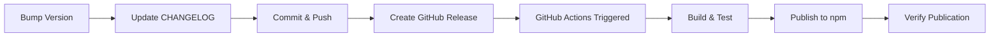

# MeMesh Release Process

This document describes the complete release process for MeMesh, including versioning, changelog maintenance, and automated publishing.

## Overview

MeMesh uses **automated npm publishing** triggered by GitHub Releases. When a new release is published on GitHub, a GitHub Actions workflow automatically builds, tests, and publishes the package to npm.

## Release Workflow



## Step-by-Step Guide

### 1. Prepare Release

#### Check Current State

```bash
# Ensure working directory is clean
git status

# Pull latest changes
git pull origin main

# Check current version
npm version
```

#### Run Full Test Suite

```bash
# Build
npm run build

# Run all tests
npm test

# Run installation tests
npm run test:install

# Type check
npm run typecheck

# Linting
npm run lint
```

All tests must pass before proceeding.

### 2. Version Bump

Choose the appropriate version bump:

- **Patch** (X.Y.Z → X.Y.Z+1): Bug fixes, minor improvements
- **Minor** (X.Y.Z → X.Y+1.0): New features, backward compatible
- **Major** (X.Y.Z → X+1.0.0): Breaking changes

```bash
# Patch release (most common)
npm version patch --no-git-tag-version

# Minor release
npm version minor --no-git-tag-version

# Major release
npm version major --no-git-tag-version
```

**Note**: We use `--no-git-tag-version` because GitHub Release creates the tag.

### 3. Update CHANGELOG.md

Add a new entry following [Keep a Changelog](https://keepachangelog.com/) format:

```markdown
## [X.Y.Z] - YYYY-MM-DD

### Added
- New features

### Changed
- Changes in existing functionality

### Deprecated
- Soon-to-be removed features

### Removed
- Removed features

### Fixed
- Bug fixes

### Security
- Security fixes
```

**Example**:
```markdown
## [2.6.6] - 2026-02-03

### Fixed
- GitHub Actions npm publish workflow - replaced invalid GitHub API method with logging
- Fixed workflow comment step that was causing publish failures
```

### 4. Commit Changes

```bash
git add package.json CHANGELOG.md
git commit -m "chore(release): bump version to X.Y.Z

- Brief description of changes
- Reference to issues/PRs if applicable

Co-Authored-By: Claude Sonnet 4.5 <noreply@anthropic.com>"
```

### 5. Push to Main

```bash
git push origin main
```

Wait for CI checks to pass (if applicable).

### 6. Create GitHub Release

#### Using GitHub CLI (Recommended)

```bash
gh release create vX.Y.Z \
  --title "vX.Y.Z - Release Title" \
  --notes "## 🎉 What's New

### ✨ Features
- Feature 1
- Feature 2

### 🔧 Fixes
- Fix 1
- Fix 2

### 📚 Documentation
- Doc updates

---

For detailed changes, see [CHANGELOG.md](https://github.com/PCIRCLE-AI/claude-code-buddy/blob/main/CHANGELOG.md)."
```

#### Using GitHub Web Interface

1. Go to https://github.com/PCIRCLE-AI/claude-code-buddy/releases
2. Click "Draft a new release"
3. Choose tag: `vX.Y.Z` (create new tag)
4. Set target: `main`
5. Fill release title: `vX.Y.Z - Release Title`
6. Write release notes (markdown supported)
7. Click "Publish release"

### 7. Automated Publishing

Once the GitHub Release is published:

1. **GitHub Actions Workflow Triggered**
   - Workflow: `.github/workflows/publish-npm.yml`
   - Trigger: `release: types: [published]`

2. **Workflow Steps**:
   ```yaml
   ✓ Checkout code
   ✓ Setup Node.js 20
   ✓ Install dependencies (npm ci)
   ✓ Build project (npm run build)
   ✓ Run tests (npm test)
   ✓ Run installation tests
   ✓ Publish to npm (with provenance)
   ✓ Log success
   ```

3. **Expected Duration**: ~2-3 minutes

### 8. Monitor Workflow

#### Using GitHub CLI

```bash
# Watch the workflow
gh run watch

# Or list recent runs
gh run list --workflow=publish-npm.yml --limit 3
```

#### Using GitHub Web Interface

1. Go to https://github.com/PCIRCLE-AI/claude-code-buddy/actions
2. Check the "Publish to npm" workflow
3. Verify all steps complete successfully

### 9. Verify Publication

#### Check npm Registry

```bash
# Check latest version
npm view @pcircle/memesh version

# Check all versions
npm view @pcircle/memesh versions

# Check package metadata
npm view @pcircle/memesh
```

#### Test Installation

```bash
# Install globally
npm install -g @pcircle/memesh@latest

# Verify version
memesh --version

# Check help
memesh --help
```

## Troubleshooting

### Workflow Fails

1. **Check workflow logs**:
   ```bash
   gh run view --log-failed
   ```

2. **Common issues**:
   - **Build fails**: Check TypeScript compilation errors
   - **Tests fail**: Ensure all tests pass locally first
   - **Publish fails (403)**: Version already published
   - **Publish fails (auth)**: Check NPM_TOKEN secret

3. **Fix and retry**:
   ```bash
   # If version already published, bump again
   npm version patch --no-git-tag-version

   # Update CHANGELOG, commit, push
   git add package.json CHANGELOG.md
   git commit -m "chore(release): bump version to X.Y.Z+1"
   git push origin main

   # Create new release
   gh release create vX.Y.Z+1 --title "..." --notes "..."
   ```

### Version Already Published

If you see:
```
npm error 403 Forbidden - You cannot publish over the previously published versions: X.Y.Z
```

**Solution**: Bump to next version and publish again. npm does not allow overwriting published versions.

### NPM_TOKEN Issues

If authentication fails:
1. Verify `NPM_TOKEN` secret exists in repository settings
2. Check token has not expired
3. Ensure token has publish permissions for `@pcircle` scope

## GitHub Actions Workflow Details

### Workflow File

Location: `.github/workflows/publish-npm.yml`

### Trigger Configuration

```yaml
on:
  release:
    types: [published]
```

### Key Features

- **Provenance**: Publishes with `--provenance` for supply chain security
- **Public Access**: Uses `--access public` for scoped package
- **Test Integration**: Runs full test suite including installation tests
- **Continue on Error**: Tests continue even if some fail (non-blocking)

### Environment Variables

- `NODE_AUTH_TOKEN`: From `secrets.NPM_TOKEN`
- `NODE_VERSION`: 20
- `REGISTRY_URL`: https://registry.npmjs.org

## Best Practices

### Version Numbering

Follow [Semantic Versioning 2.0.0](https://semver.org/):

- **MAJOR**: Breaking changes (X.0.0)
- **MINOR**: New features, backward compatible (0.X.0)
- **PATCH**: Bug fixes (0.0.X)

### Release Frequency

- **Patch releases**: As needed for urgent fixes
- **Minor releases**: When significant features are ready
- **Major releases**: When breaking changes are necessary

### Release Notes

Good release notes include:
- **What changed**: Clear description of changes
- **Why it matters**: Impact on users
- **Migration guide**: For breaking changes
- **Credits**: Acknowledge contributors

### Testing Before Release

Always test:
1. ✅ Local build succeeds
2. ✅ All unit tests pass
3. ✅ Integration tests pass
4. ✅ Installation test passes
5. ✅ Type checking passes
6. ✅ Linting passes

### CHANGELOG Maintenance

- Update CHANGELOG.md for every release
- Group changes by category (Added, Changed, Fixed, etc.)
- Write user-facing descriptions (not technical details)
- Link to relevant issues/PRs

## Emergency Rollback

If a release has critical issues:

1. **Do NOT unpublish from npm** (breaks dependent projects)

2. **Instead, publish a hotfix**:
   ```bash
   # Fix the issue
   # Bump version
   npm version patch --no-git-tag-version

   # Update CHANGELOG with fix
   # Commit and release
   ```

3. **Or deprecate the version**:
   ```bash
   npm deprecate @pcircle/memesh@X.Y.Z "Critical bug, use X.Y.Z+1 instead"
   ```

## Release Checklist

Use this checklist for every release:

- [ ] Pull latest changes from main
- [ ] All tests pass locally
- [ ] Version bumped in package.json
- [ ] CHANGELOG.md updated
- [ ] Changes committed and pushed
- [ ] GitHub Release created
- [ ] Workflow completed successfully
- [ ] Package published to npm
- [ ] Version verified on npm
- [ ] Installation tested
- [ ] Documentation updated (if needed)
- [ ] Announcement posted (if major release)

## References

- [npm Documentation](https://docs.npmjs.com/)
- [GitHub Actions - Publishing Node.js packages](https://docs.github.com/en/actions/publishing-packages/publishing-nodejs-packages)
- [Semantic Versioning](https://semver.org/)
- [Keep a Changelog](https://keepachangelog.com/)
- [Conventional Commits](https://www.conventionalcommits.org/)

## Questions?

- Check [GitHub Discussions](https://github.com/PCIRCLE-AI/claude-code-buddy/discussions)
- Open an [Issue](https://github.com/PCIRCLE-AI/claude-code-buddy/issues)
