# Smart Agents Architecture Diagram

## System Overview

```mermaid
graph TB
    User[👤 User] -->|Task Request| CC[Claude Code CLI]
    CC -->|MCP Protocol| MCP[MCP Server]
    MCP -->|Analyze Task| TA[Task Analyzer]
    TA -->|Task Analysis| AR[Agent Router]

    AR -->|Route to Agent| Real[Real Agents<br/>5 implementations]
    AR -->|Route to Agent| Prompt[Enhanced Prompt Agents<br/>7 templates]
    AR -->|Route to Agent| Opt[Optional Feature<br/>1 agent]

    Real -->|Automation| Butler[Development Butler]
    Real -->|Testing| TW[Test Writer]
    Real -->|DevOps| DE[DevOps Engineer]
    Real -->|Management| PM[Project Manager]
    Real -->|Data| Data[Data Engineer]

    Prompt -->|Architecture| Arch[Architecture Agent]
    Prompt -->|Code Quality| CR[Code Reviewer]
    Prompt -->|Security| Sec[Security Auditor]
    Prompt -->|Design| UI[UI Designer]
    Prompt -->|Marketing| Market[Marketing Strategist]
    Prompt -->|Product| Prod[Product Manager]
    Prompt -->|ML| ML[ML Engineer]

    Opt -->|RAG Search| RAG[RAG Agent]

    Real -->|Enhanced Prompt| PE[Prompt Enhancer]
    Prompt -->|Enhanced Prompt| PE
    Opt -->|Enhanced Prompt| PE

    PE -->|Optimized Prompt| CC
    CC -->|Execute| Anthropic[Anthropic API<br/>Claude Sonnet 4.5]
    Anthropic -->|Response| User

    style Real fill:#90EE90
    style Prompt fill:#87CEEB
    style Opt fill:#FFE4B5
    style Anthropic fill:#FFB6C1
```

## Component Details

### Task Analyzer
- Analyzes task complexity (simple/medium/complex)
- Identifies required capabilities
- Estimates token costs

### Agent Router
- Routes tasks based on capabilities
- Selects appropriate agent (real, prompt-enhanced, or optional)
- Checks system resources (CPU, memory)

### Real Agents (5)
These have actual code implementations:
- **Development Butler**: Event-driven automation, workflow hooks
- **Test Writer**: Automated test generation
- **DevOps Engineer**: CI/CD, deployment automation
- **Project Manager**: Task tracking, progress monitoring
- **Data Engineer**: Data pipeline management

### Enhanced Prompt Agents (7)
These are prompt templates that enhance Claude's capabilities:
- **Architecture Agent**: System design, architectural decisions
- **Code Reviewer**: Code quality, best practices
- **Security Auditor**: Security analysis, vulnerability detection
- **UI Designer**: User interface design, UX patterns
- **Marketing Strategist**: Marketing strategy, content planning
- **Product Manager**: Product planning, roadmap
- **ML Engineer**: Machine learning, model development

### Optional Feature (1)
- **RAG Agent**: Vector search, embeddings (requires OpenAI API key)

### Prompt Enhancer
- Combines agent expertise into enhanced prompt
- Adds best practices and contextual knowledge
- Optimizes for Claude API execution

## Data Flow

1. **User → Claude Code**: Task request via CLI
2. **Claude Code → MCP Server**: Task forwarded via MCP protocol
3. **MCP → Task Analyzer**: Analyze complexity and requirements
4. **Task Analyzer → Agent Router**: Routing decision based on analysis
5. **Agent Router → Agent**: Select and activate appropriate agent
6. **Agent → Prompt Enhancer**: Generate enhanced prompt with agent expertise
7. **Prompt Enhancer → Claude Code**: Return optimized prompt
8. **Claude Code → Anthropic API**: Execute with user's API key
9. **Anthropic API → User**: Final response delivered

## Color Legend

- 🟢 **Green (Real Agents)**: Have actual code implementations
- 🔵 **Blue (Enhanced Prompts)**: Prompt templates
- 🟡 **Yellow (Optional)**: Requires additional configuration
- 🌸 **Pink (Anthropic API)**: External API service
